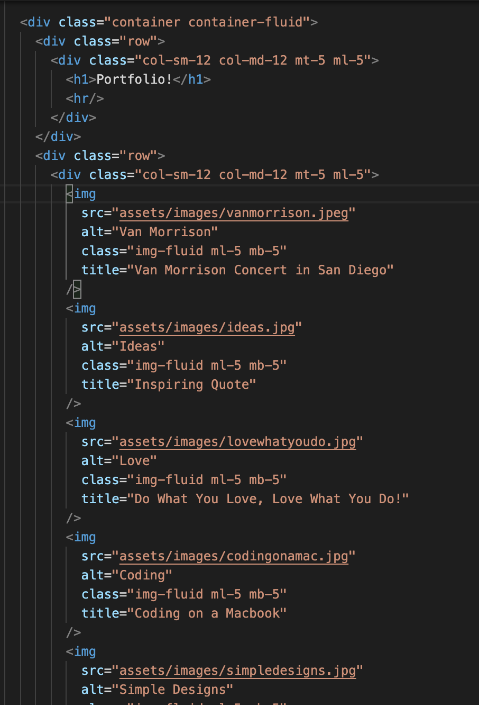

# Bootstrap-Portfolio

You can visit my project's portfolio by clicking <a href="https://guled06.github.io/Bootstrap-Portfolio/">Here</a>

I created a three html files (pages). I created an home.html, portfolio.html and a contact.html pages. I linked each of these html pages with a bootstrap css links. Within each of the pages, I linked them with a separate my own person css links. For example, the home.html is linked with a boostrap css link AND a home.css link. 

The porfolio.html is linked to a boostrap css link AND a porfolio.css link. 

The contact.html is linked to a bostrap css link AND a contact.css link.

After creating my links, I went into the body tag of my html and created a navbar to give all my pages a navbar that contains three links (Home, Portfolio and Contact) links. I interconnected the links so that when the user click the -Portfolio- link from the Home page, it will take the user to the Portfolio page. When the user clicks the -Contact- link, it will take the user to the contact page. 

After creating my navbar and giving a background color of secondary via the bootstrap css layout. The boostrap layout provided a navbar that gives the link of each page an 'active' status. 

Afterwards, I copied and paste a container that a row and colums and pasted into my html pages. For the my Portfolio page, I gave it a container that has a two row. The first row has one colum that is set to the size of a full 12 colums in small screen and medium screen. The second row, I also gave it one colum with the size of a full 12 colums in a small screen and medium screen. Please see below image for further demonstration.

After giving containers, rows and colums to my three pages. I gave each page a footer. I customized the footer in the css pages I linked to each page and I customized it exactly the same for each page. 

In order for the pages to fit into different screen sizes, I added a @media query to make the pages fluid. 

